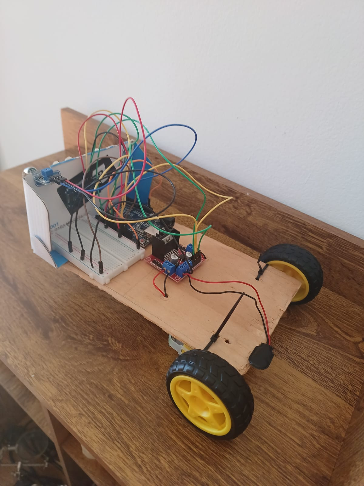

# Projeto Pinocch-IO
Um projeto de robô que desenvolvo por hobby enquanto pratico um pouco de robótica. Inicialmente, estou utilizando um simples `Arduino UNO` integrado a um driver de motor com dois motores e alguns poucos sensores. A programação do robô é toda feita em `C++` através do framework `Platform.IO`.

## O Protótipo
Tudo começa com uma ideia bem simples: um robô que apenas anda em linha reta e que fica parado quando o sensor ultrassônico percebe um obstáculo à frente.

    
    

## Links externos
- [Quadro no Trello com andamento do projeto](https://trello.com/b/LF1wZCdL/project-pinnoch-io)
- [Diagramas e Fluxogramas]()